<strong>Добро пожаловать!</strong> 
Меня зовут <b>Игорь Потахин</b> - <em>я разработчик.</em>
> <strong>Telegram:</strong> <em>[t.me/archimage_wiz](https://t.me/archimage_wiz)</em> 💬 
> <strong>E-Mail:</strong> <em>[archimage@yandex.com](mailto:archimage@yandex.com)</em> 📫 

#### Ключевые навыки:
> DataScience: Pandas, NumPy, Scikit-learn, (PLT, SNS), Beautiful Soup, DBeaver..
- Backend: Python, Django, DRF, Flask, Celery, Aiohttp, CI/CD, Requests, SQL Academy.
- Frontend: HTML, CSS, JS, React..
- Other: SQL, PostgreSQL, Docker, Git, ~$

#### История проектов (Новые сверху):
- Еще сертификаты:  
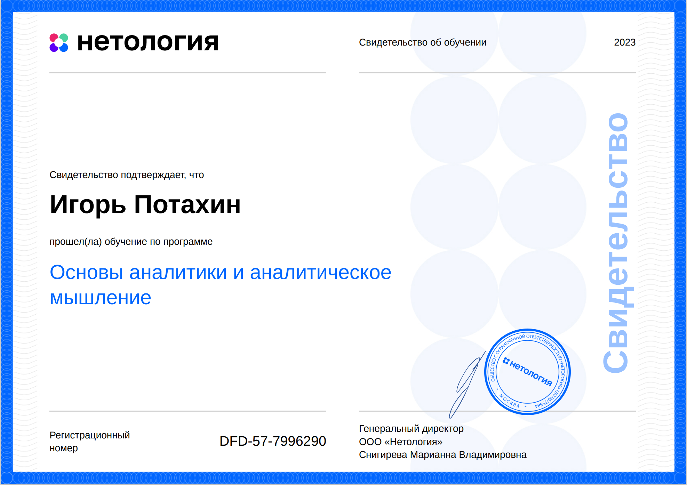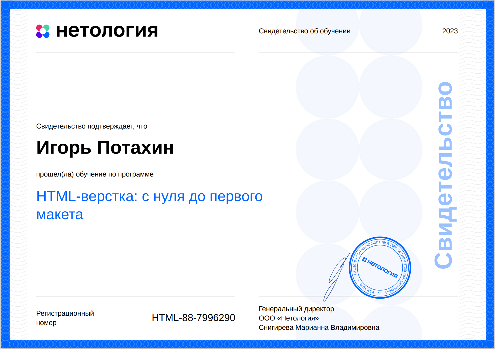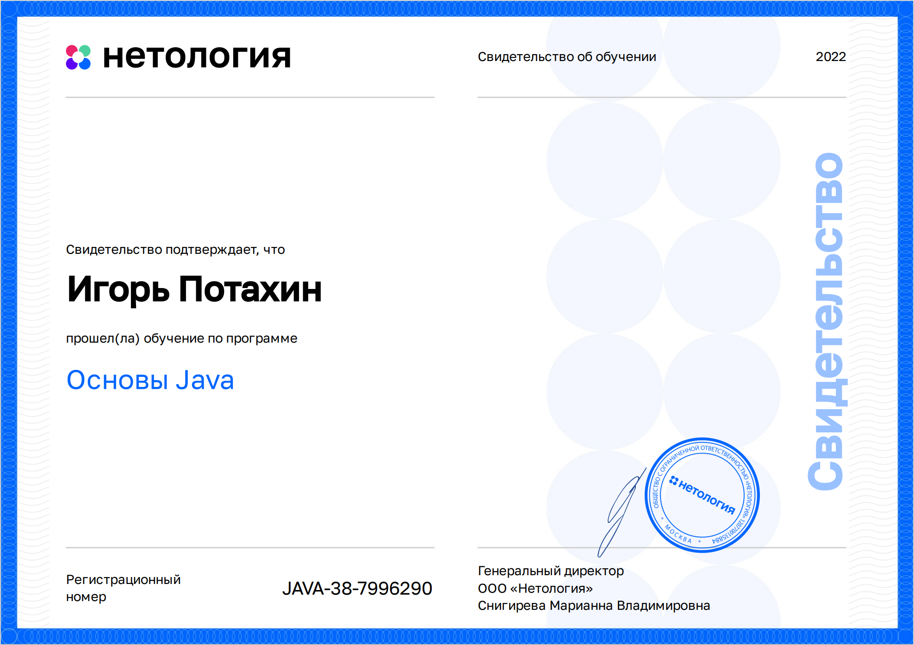  
- Верстка первого макета: [На сервере](http://eeee.one/demo/first_maket/). 
  
- Дипломная работа в Нетологии: [API Сервис заказа товаров для розничных сетей на Django](https://github.com/archimage-wiz/PythonDiplom). 
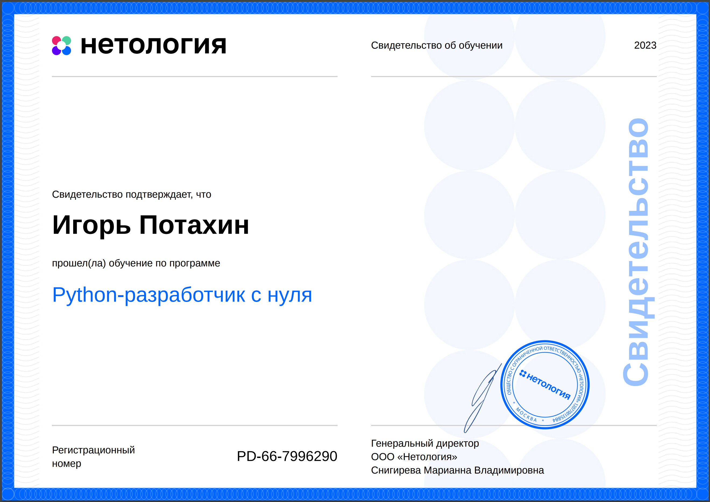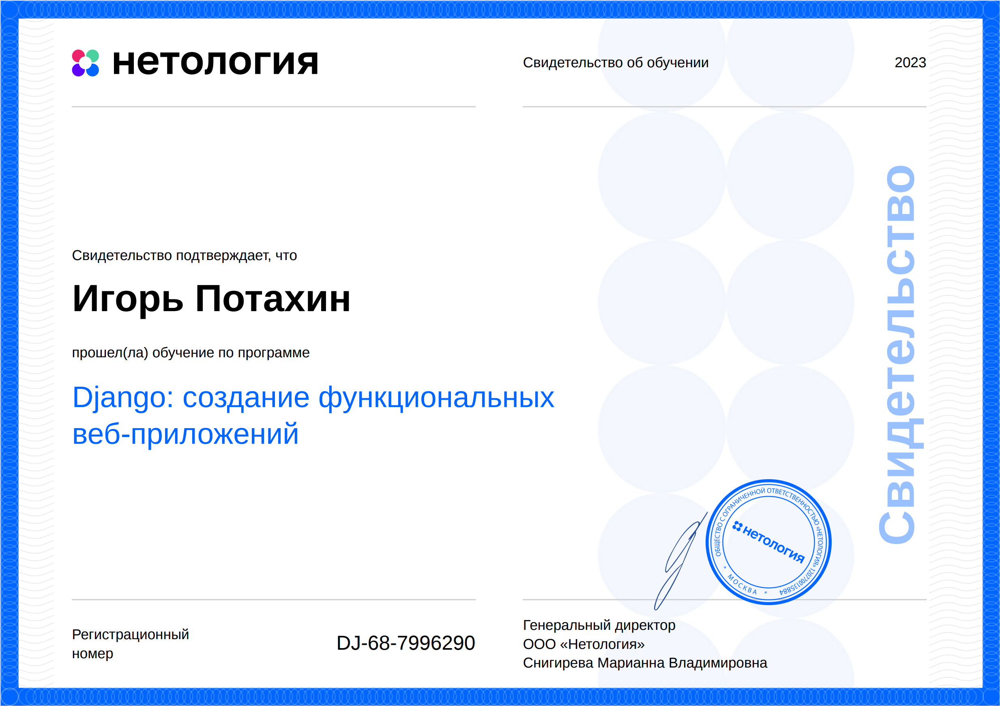  
- Кома́ндный курсовой проект: [чат бот для поиска пары](https://github.com/archimage-wiz/adpy-team-diplom). 
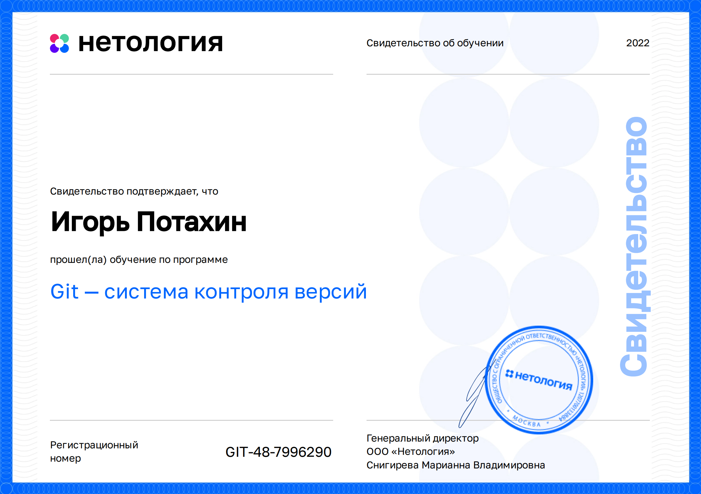 
- Прочие задачи: [Image resizing with Celery](https://github.com/archimage-wiz/Hw8_Celery). 
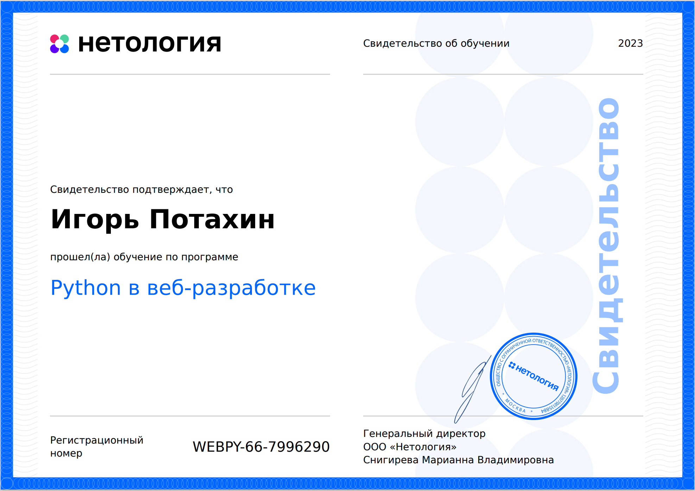 
- [Docker Django App Demo](https://github.com/archimage-wiz/Hw4_DockerCompose_Nginx-WebApp-PostgreSQL).
- [БД из Python psycopg2](https://github.com/archimage-wiz/PY_CASEDB_Hw5_PostgreSQL_Python_Requests). [БД через Python ORM](https://github.com/archimage-wiz/PY_CASEDB_Hw6_SQLAlchemy). [SQL Создание, запросы](https://github.com/archimage-wiz/PY_CASEDB_Hw4). 
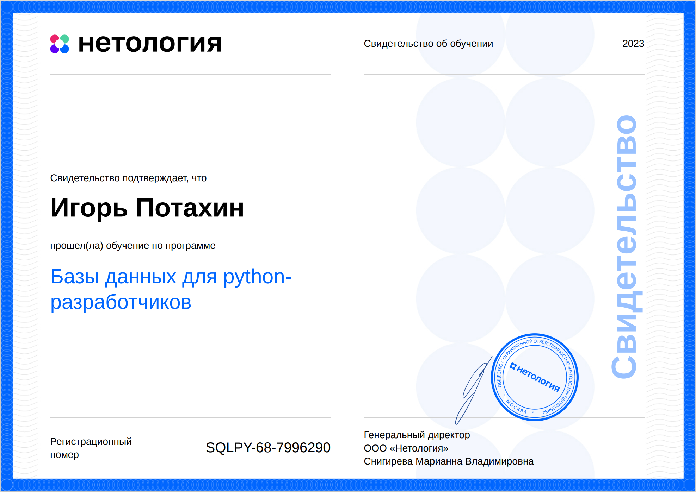  
- [Прототип: Ai Enemies](https://github.com/archimage-wiz/Unity_Case3_AdvUnity_Hw3_Hw3_Ai_Enemies). 
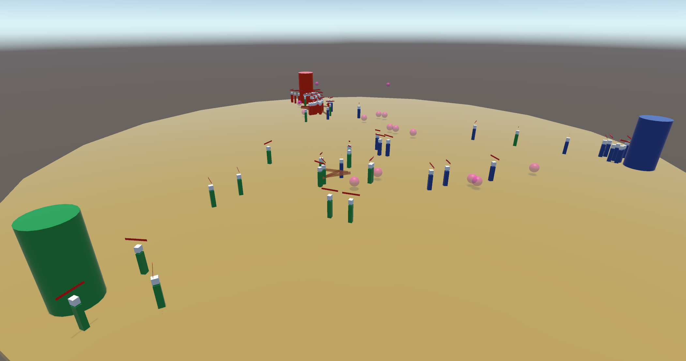 
- [Прототип: 3D Арканоид](https://github.com/archimage-wiz/Unity_Case3_AdvUnity_Hw1_Arkanoid). 
 
- [Прототип: Игра шашки](https://github.com/archimage-wiz/Unity_Case2_Hw34). 
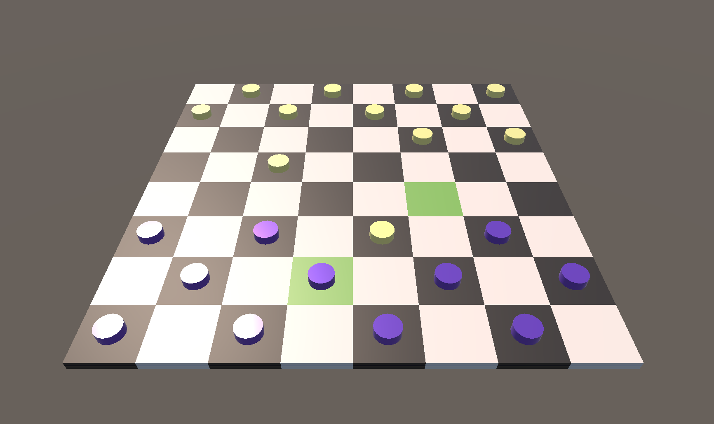 
- [Прототип: Runner Game](https://github.com/archimage-wiz/Unity_Case1_RunnerProto). 
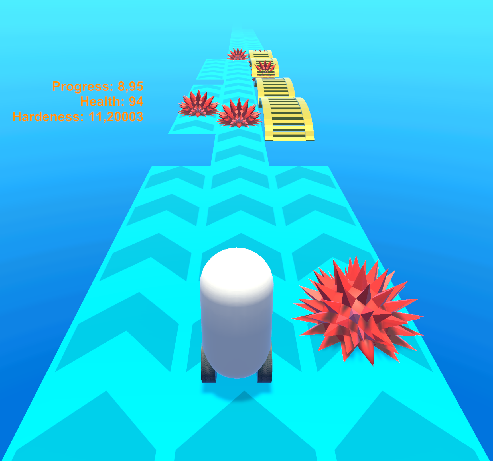  
- [Консольная игра демо на С++](https://github.com/archimage-wiz/LifeGame_demo). 
 

#### Ссылки на другие ресурсы.
- Страница на Хабр карьера. (https://career.habr.com/archimage_wiz). 

#### Спасибо за ваш визит!

