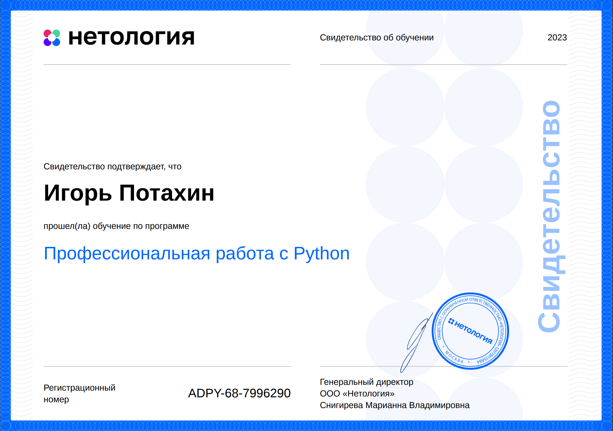

<strong>Добро пожаловать!</strong> 
Знакомьтесь: <b>Игорь Потахин</b> - <em>Разработчик удивительных штуковин.</em>
> <strong>Telegram:</strong> <em>[t.me/archimage_wiz](https://t.me/archimage_wiz)</em> 
> <strong>E-Mail:</strong> <em>[archimage@yandex.com](mailto:archimage@yandex.com)</em> 

#### Мои навыки:
###### Python:
> Кома́ндный курсовой проект: [чат бот для поиска пары](https://github.com/archimage-wiz/adpy-team-diplom). 
> Домашние задания: [Web scrapping](https://github.com/archimage-wiz/PY_CASE3_PyAdvanced_Hw3_WebSCrapping).
[Тесты](https://github.com/archimage-wiz/PY_Advanced_Hw6_PyTest).
[Декораторы](https://github.com/archimage-wiz/PY_CASE3_PyAdvanced_Hw5_Decorators).
[Итераторы](https://github.com/archimage-wiz/PY_CASE3_PyAdvanced_Hw4_yield).
[Регулярные выражения](https://github.com/archimage-wiz/PY_CASE3_PyAdvanced_Hw2). 
Сертификаты:

###### PostreSQL (Базы данных)
> Домашние задания: 
[БД через Python ORM](https://github.com/archimage-wiz/PY_CASEDB_Hw6_SQLAlchemy).
[БД из Python psycopg2](https://github.com/archimage-wiz/PY_CASEDB_Hw5_PostgreSQL_Python_Requests).
[SQL Создание, запросы](https://github.com/archimage-wiz/PY_CASEDB_Hw4).

### Professional background
> Python + PostreSQL + Git  
> C# + Unity  
> Java, HTML, CSS, Perl and C++ for a little things. 

#### Where to go for something wonderful
> Life game [demo](https://github.com/archimage-wiz/LifeGame_demo) on GitHub 

> Habr [&#8721;](https://career.habr.com/archimage_wiz) page. 
> [Hacker Rank](https://www.hackerrank.com/archimage) restricted zone. 
> Replit [code run](https://replit.com/@archimage) site. 

###### Thank you for visit!

<!--

✨ 

- 🔭 I’m currently working on ...
- 🌱 I’m currently learning ...
- 👯 I’m looking to collaborate on ...
- 🤔 I’m looking for help with ...
- 💬 Ask me about ...
- 📫 How to reach me: ...
- 😄 Pronouns: ...
- ⚡ Fun fact: ...
-->
